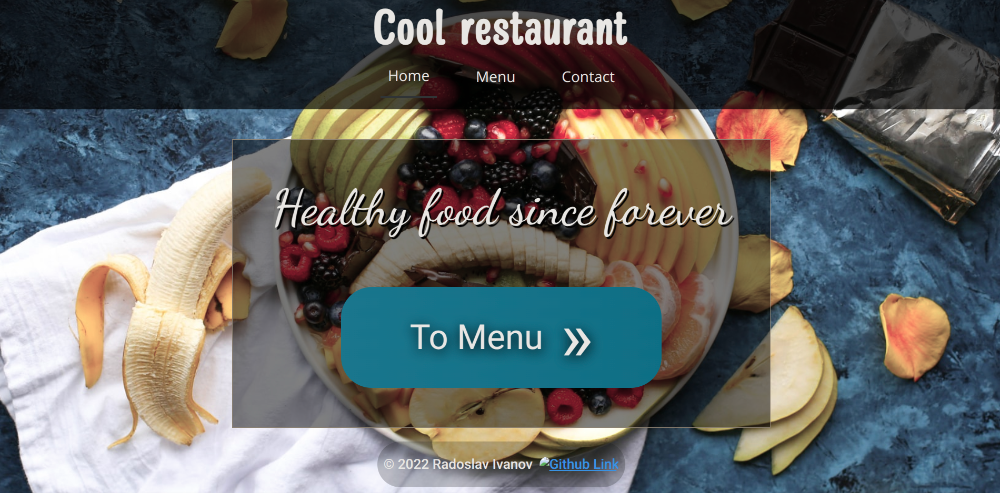
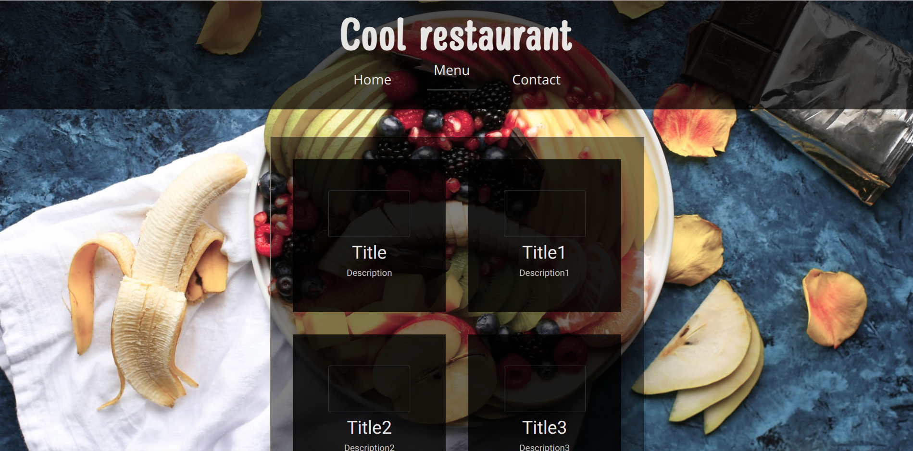

# Restaurant page
Dynamically rendered restaurant page using just JS the DOM API
No refresh needed to browse the website
# Point
Project made in 2022 with the point of getting used to:
* Manipulating the DOM
* Using Webpack to build, bundle and minify the website
# Preview
  

# Usage
* Clone repo
* `npm install`
* Run scripts
`npm run start`
To run with webpack

`npm run build`
To populate `dist` folder with minified production files
